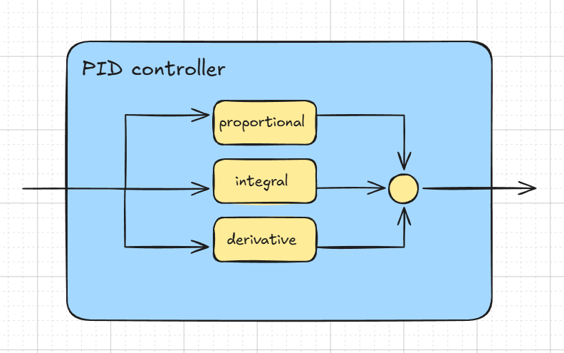
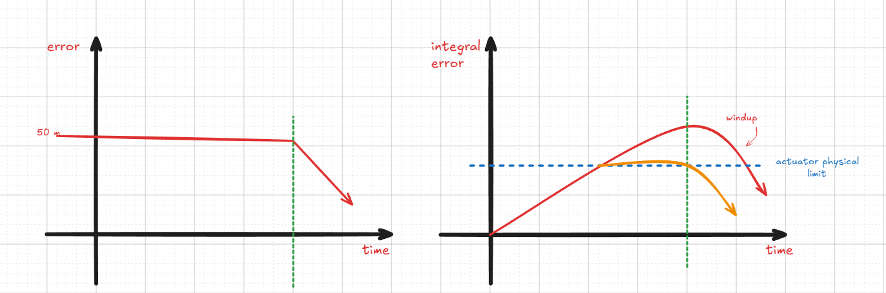
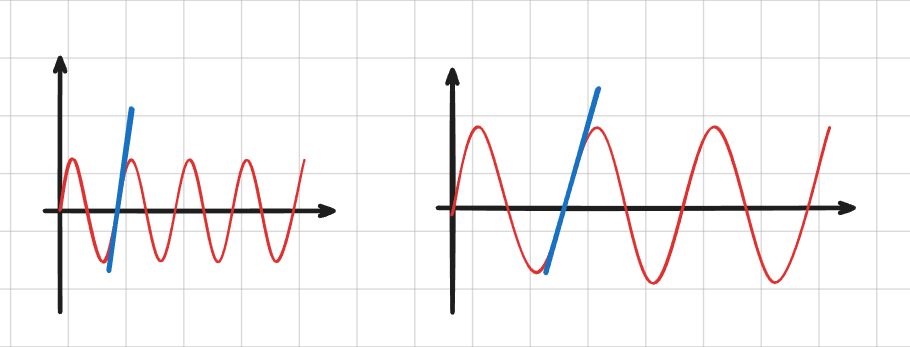

## what it is 

At its heart, a PID controller does one thing: it looks at the gap between where you are and where you want to be, and decides how hard to push to close that gap.

That gap is called the **error**:

e(t)=SP−PV

Where:

- SP = Setpoint (the desired value)
- PV = Process Variable (the measured value)
- e(t) = Error at time t

## Components 

### Proportional (P)
The P term produces an output proportional to the current error: **$P_{output}=K_p×e(t)$**
### Integral (I)
The I term accumulates error over time : **$I_{output}=K_i×∫e(t)dt$

>for digital signals 
>the integral error is calculated as the sum of ( previas error + current error) and at any given period of time  the error is calculated as a rectangular whare
>the width is $\Delta (t)$ and the height is the error 
#### $$I_{output}[n] = I_{output}[n-1] + K_i \times e[n] \times \Delta t$$
**note we need delta t**

**windup** is when the error integral component accumulates over time while the output is saturated (reached it's physical limit) and when the process finally responds, it overshoots badly because the integrator is still unwinding.

>example 

if you set a drown to fly up to 50 m but when you start it you hold the drown to check some parameters before letting it go.
while that happening the process is not responding to the error and as the integral component is equal to the area under the curve it keeps raising even after the actuator reach is its physical limit (saturation) like heater maximum power or motor maximum speed .
and when you finally let the drown go (the green dotted line) and the error suppose to start decreasing the integral component is still very high and it will cause your drown to overshoot .

>so how to solve it ?

we need to set a limit for the integral component so it stops accumulating after reaching near saturation limit
what is windup ? and how to control it (anti-windup)

###  Derivative (D)

The D term reacts to the rate of change of error:

#### $D_{output​}=K_d× \frac {de(t)}{dt}$

and for discrete form 

#### $D_{output} = K_d \frac{(e[n]-e[n-1])}{\Delta t}$

when dealing with sensors we almost always encounter **noise** the problem that noisy data has high frequency -> high slop -> high derivative -> larger error 
so we need to add Low pass filter to block high frequencies .

filter + derivative or  feedback integral with cutoff n 

## the final form 

## $Co(t) = K_pe(t) +K_i\int {e(t) dt} + K_d \frac {de(t)}{dt}$

